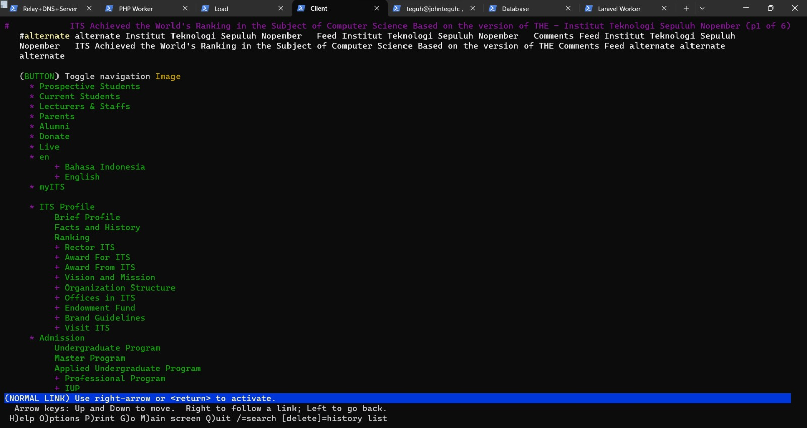
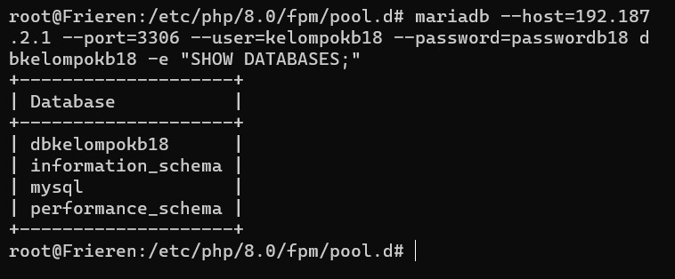
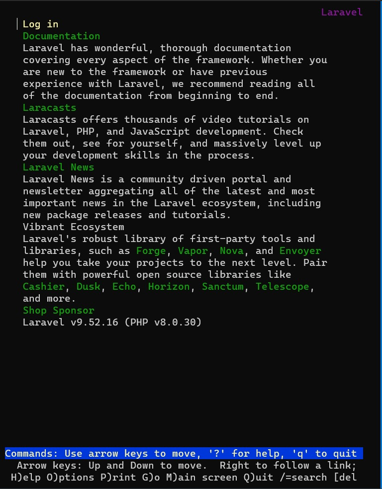

# Jarkom-Modul-3-B18-2023

## Kelompok B18

|          Nama          |    NRP     |
| :--------------------: | :--------: |
|  Aryan Shafa Wardana   | 5025211031 |
| Shazia Ingeyla Naveeda | 5025211203 |

## Nomor 0
### Soal
Setelah mengalahkan Demon King, perjalanan berlanjut. Kali ini, kalian diminta untuk melakukan register domain berupa riegel.canyon.yyy.com untuk worker Laravel dan granz.channel.yyy.com untuk worker PHP mengarah pada worker yang memiliki IP [prefix IP].x.1.

##### Penyelesaian
Pada node `DNS Server` lakukan konfigurasi zone untuk domain dengan menggunakan bind9. Pada `/etc/bind/named.conf.local` akan tampak sebagai berikut


Lalu pada directory `/etc/bind/hero` akan terdapat dua file yaitu

- `/etc/bind/hero/canyon.b18.com`


- `/etc/bind/hero/channel.b18.com`


## Nomor 1
### Soal
Lakukan konfigurasi sesuai dengan peta yang sudah diberikan.

Kemudian, karena masih banyak spell yang harus dikumpulkan, bantulah para petualang untuk memenuhi kriteria berikut.:
1. Semua CLIENT harus menggunakan konfigurasi dari DHCP Server.

#### Penyelesaian
Berikut gambar topologi


Lalu pada setiap client dilakukan konfigurasi pada network settingnya dengan setiap client berisikan
```sh
auto eth0
iface eth0 inet dhcp
```

## Nomor 2 3 5
### Soal
2. Client yang melalui Switch3 mendapatkan range IP dari [prefix IP].3.16 - [prefix IP].3.32 dan [prefix IP].3.64 - [prefix IP].3.80
3. Client yang melalui Switch4 mendapatkan range IP dari [prefix IP].4.12 - [prefix IP].4.20 dan [prefix IP].4.160 - [prefix IP].4.168
5. Lama waktu DHCP server meminjamkan alamat IP kepada Client yang melalui Switch3 selama 3 menit sedangkan pada client yang melalui Switch4 selama 12 menit. Dengan waktu maksimal dialokasikan untuk peminjaman alamat IP selama 96 menit

#### Penyelesaian
Karena DHCP Server tidak terhubung dengan client secara langsung maka lakukan juga konfigurasi untuk DHCP Relay yaitu pada router. Pada DHCP relay lakukan konfigurasi pada `/etc/default/isc-dhcp-relay` dan akan tampak sebagai


dan pada `/etc/sysctl.conf`, untuk comment pada
```sh
net.ipv4.ip_forward=1
```
Lakukan konfigurasi pada file `/etc/default/isc-dhcp-server` dan akan tampak seperti


Lakukan konfigurasi pada file `/etc/dhcp/dhcpd.conf` dan akan tampak seperti


## Nomor 4
### Soal
4. Client mendapatkan DNS dari Heiter dan dapat terhubung dengan internet melalui DNS tersebut

#### Penyelesaian
Lakukan konfigurasi pada DNS Master pada file `/etc/bind/named.conf.options` untuk melakukan forwarder sehingga dapat connect ke internet


## Nomor 6
### Soal
Pada masing-masing worker PHP, lakukan konfigurasi virtual host untuk website berikut dengan menggunakan php 7.3.

##### Penyelesaian
Pada setiap php worker, lakukan instalasi dengan script berikut
```sh
apt-get install php -y
apt-get install php php-fpm -y
apt-get install nginx -y
pt-get install wget -y
apt-get install unzip -y
wget -O '/var/www/granz.channel.b18.com' 'https://drive.google.com/u/0/uc?id=1ViSkRq7SmwZgdK64eRbr5Fm1EGCTPrU1&export=download'
unzip -o /var/www/granz.channel.b18.com -d /var/www/
rm /var/www/granz.channel.b18.com
mv /var/www/modul-3 /var/www/granz.channel.b18.com
```
Lalu lakukan konfigurasi pada `/etc/nginx/sites-available/granz.channel.b18.com` dan tampak seperti ini


### Nomor 7
Kepala suku dari Bredt Region memberikan resource server sebagai berikut:
- Lawine, 4GB, 2vCPU, dan 80 GB SSD.
- Linie, 2GB, 2vCPU, dan 50 GB SSD.
- Lugner, 1GB, 1vCPU, dan 25 GB SSD.

aturlah agar Eisen dapat bekerja dengan maksimal, lalu lakukan testing dengan 1000 request dan 100 request/second.

#### Penyelesaian
Menggunakan Weighted Round Robin maka server yang memiliki weight paling besar akan dijadikan prioritas ketika menerima request dari client. Pada node Eisen jalankan perintah berikut 
```sh
echo nameserver 192.168.122.1 > /etc/resolv.conf
apt-get update
apt install nginx php php-fpm -y

nano /etc/nginx/sites-available/lb-eisen

(((setelah mengedit konfigurasi)))
ln -s /etc/nginx/sites-available/lb-eisen /etc/nginx/sites-enabled
rm -r /etc/nginx/sites-enabled/default
service nginx start
```
Tambahkan konfigurasi berikut
```
upstream myweb {
    server 192.187.3.1 weight=1;
    server 192.187.3.2 weight=2;
    server 192.187.3.3 weight=4;
}

server {
    listen 80;
    server_name 192.187.2.2;
    location / {
        proxy_pass http://myweb;
        }
```

Lalu pada node Heiter lakukan konfigurasi pada ``/etc/bind/jarkom/granz.channel.b17.com`` dan arahklan IP ke Load Balancer ``10.17.2.2`` dan restart bind9
```sh
service bind9 restart
```

**Lakukan testing pada salah satu client**
```sh
apt-get install apache2
service apache2 start
ab -n 1000 -c 100 192.187.2.2/ 
```

**Hasil**
```
This is ApacheBench, Version 2.3 <$Revision: 1843412 $>
Copyright 1996 Adam Twiss, Zeus Technology Ltd, http://www.zeustech.net/
Licensed to The Apache Software Foundation, http://www.apache.org/

Benchmarking 192.187.2.2 (be patient)
Completed 100 requests
Completed 200 requests
Completed 300 requests
Completed 400 requests
Completed 500 requests
Completed 600 requests
Completed 700 requests
Completed 800 requests
Completed 900 requests
Completed 1000 requests
Finished 1000 requests


Server Software:        nginx/1.14.2
Server Hostname:        192.187.2.2
Server Port:            80

Document Path:          /
Document Length:        195 bytes

Concurrency Level:      100
Time taken for tests:   0.647 seconds
Complete requests:      1000
Failed requests:        0
Non-2xx responses:      1000
Total transferred:      395000 bytes
HTML transferred:       195000 bytes
Requests per second:    1546.04 [#/sec] (mean)
Time per request:       64.681 [ms] (mean)
Time per request:       0.647 [ms] (mean, across all concurrent requests)
Transfer rate:          596.37 [Kbytes/sec] received

Connection Times (ms)
              min  mean[+/-sd] median   max
Connect:        5   16   7.2     14      36
Processing:     6   20  17.0     17     269
Waiting:        6   19  13.2     16     269
Total:         15   35  18.1     34     288

Percentage of the requests served within a certain time (ms)
  50%     34
  66%     38
  75%     42
  80%     43
  90%     49
  95%     52
  98%     55
  99%     64
 100%    288 (longest request)
```

## Nomor 8
### Soal
Karena diminta untuk menuliskan grimoire, buatlah analisis hasil testing dengan 200 request dan 10 request/second masing-masing algoritma Load Balancer dengan ketentuan sebagai berikut:
- Nama Algoritma Load Balancer
- Report hasil testing pada Apache Benchmark
- Grafik request per second untuk masing masing algoritma. 
- Analisis

#### Penyelesaian
**Lakukan testing pada salah satu client**
```sh
ab -n 200 -c 10 192.187.2.2/ 
```

- Algo Round Robin ( 691.12 [#/sec] (mean) )


- Algo Least Connection (  635.47 [#/sec] (mean) )


- Algo IP Hash (  684.04 [#/sec] (mean) )
  


- Algo Generic Hash ( 638.46 [#/sec] (mean) )


**Grafik request per second**


## Nomor 9
### Soal
Dengan menggunakan algoritma Round Robin, lakukan testing dengan menggunakan 3 worker, 2 worker, dan 1 worker sebanyak 100 request dengan 10 request/second, kemudian tambahkan grafiknya pada grimoire.

#### Penyelesaian
**Lakukan testing pada salah satu client**
```sh
ab -n 100 -c 10 192.187.2.2/ 
```

- 3 Worker


- 2 Worker


- 1 Worker


**Grafik**


## Nomor 10
### Soal
Selanjutnya coba tambahkan konfigurasi autentikasi di LB dengan dengan kombinasi username: “netics” dan password: “ajkyyy”, dengan yyy merupakan kode kelompok. Terakhir simpan file “htpasswd” nya di /etc/nginx/rahasisakita/

#### Penyelesaian

Lakukan perintah berikut di node Eisen
```sh
mkdir /etc/nginx/rahasisakita
htpasswd -c /etc/nginx/rahasisakita/htpasswd netics
```

Lalu, masukkan passwordnya ``ajkb18``

Jika sudah memasukkan password dan re-type password. Sekarang bisa dicoba dengan menambahkan command berikut pada setup nginx

```sh
auth_basic "Administrator";
auth_basic_user_file /etc/nginx/rahasisakita/ .htpasswd;
```

**Lakukan testing pada salah satu client**
```sh
lynx 10 192.187.2.2
```


## Nomor 11

### Soal

Lalu buat untuk setiap request yang mengandung /its akan di proxy passing menuju halaman https://www.its.ac.id. (11) hint: (proxy_pass)

### Pembahasan

Untuk soal ini, kita bisa menambahkan konfigurasi berikut pada load balancer Eisen di `/etc/nginx/sites-available/lb-eisen`

```nginx
server {
    listen 80;
    server_name 192.187.2.2;

    ....

    location ~ /its {
        proxy_pass https://www.its.ac.id;
    }

    ....
}
```

Untuk mencoba konfigurasinya kembali, kita bisa restart service nginx menggunakan
`service nginx restart`. Lalu pada client, mencoba akses load balancer menggunakan

```bash
$ lynx 192.187.2.2/its
```

Hasil yang diperoleh seperti berikut.



## Nomor 12

### Soal

Selanjutnya LB ini hanya boleh diakses oleh client dengan IP [Prefix IP].3.69, [Prefix IP].3.70, [Prefix IP].4.167, dan [Prefix IP].4.168. (12) hint: (fixed in dulu clinetnya)

### Pembahasan

Untuk soal ini, kita bisa menambahkan konfigurasi berikut pada load balancer Eisen di `/etc/nginx/sites-available/lb-eisen`

```nginx
server {
    listen 80;
    server_name 192.187.2.2;

    ....

    location / {
		proxy_pass http://granzchannel;

		auth_basic "Administrator";
		auth_basic_user_file /etc/nginx/rahasisakita/.htpasswd;
+++		allow 192.187.3.69;
+++		allow 192.187.3.70;
+++		allow 192.187.4.167;
+++		allow 192.187.4.168;
+++	    deny all;
	}

    ....
}
```

Untuk mencoba konfigurasinya kembali, kita bisa restart service nginx menggunakan
`service nginx restart`. Lalu supaya bisa diakses oleh client, kita bisa menambahkan konfigurasi berikut pada Himmel di `/etc/dhcp/dhcpd.conf`.

```conf
....

host Richter {
	hardware ethernet 86:82:75:00:6a:d4;
	fixed-address 192.187.3.69;
}

host Revolte {
	hardware ethernet 6a:ad:e3:70:a8:eb;
	fixed-address 192.187.3.70;
}

....

host Stark {
	hardware ethernet 86:3b:d1:3f:f1:4b;
	fixed-address 192.187.4.167;
}

host Sein {
	hardware ethernet 86:82:75:00:6a:d4;
	fixed-address 192.187.4.168;
}

....
```

Kemudian restart service dhcp menggunakan `service isc-dhcp-server restart`. Lalu kita bisa akses load balancer menggunakan

```bash
$ lynx 192.187.2.2
```

Hasil yang diperoleh seperti berikut. Jika client mengakses `192.187.2.2` maka akan muncul website seperti biasa.


Namun jika selain client mengakses `192.187.2.2` maka akan muncul error.


## Nomor 13

### Soal

Semua data yang diperlukan, diatur pada Denken dan harus dapat diakses oleh Frieren, Flamme, dan Fern.

### Pembahasan

Untuk soal ini, kita bisa install `mariadb-server` lalu menambahkan konfigurasi berikut di `/etc/mysql/my.cnf`.

```cnf
[mysqld]
skip-networking=0
skip-bind-address
```

Kemudian menjalankan command sql berikut

```sql
CREATE USER IF NOT EXISTS 'kelompokb18'@'%' IDENTIFIED BY 'passwordb18';
CREATE USER IF NOT EXISTS 'kelompokb18'@'localhost' IDENTIFIED BY 'passwordb18';
CREATE DATABASE IF NOT EXISTS dbkelompokb18;
GRANT ALL PRIVILEGES ON *.* TO 'kelompokb18'@'%';
GRANT ALL PRIVILEGES ON *.* TO 'kelompokb18'@'localhost';
FLUSH PRIVILEGES;
```

Setelah itu, restart service mysql menggunakan `service mysql restart`. Kita bisa mencoba akses databasenya di client dengan install `mariadb-client` lalu menjalankan command berikut

```bash
$ mariadb --host=192.187.2.1 --port=3306 --user=kelompokb18 --passwordb18
```

Hasil yang diperoleh seperti berikut.


## Nomor 14

### Soal

Frieren, Flamme, dan Fern memiliki Riegel Channel sesuai dengan quest guide berikut. Jangan lupa melakukan instalasi PHP8.0 dan Composer.

### Pembahasan

Untuk soal ini, pada setiap worker laravel, kita bisa install php, nginx, dan install composer dengan command-command berikut.

```bash
$ apt-get install mariadb-client -y

$ apt-get install lsb-release ca-certificates apt-transport-https software-properties-common gnupg2 -y

$ curl -sSLo /usr/share/keyrings/deb.sury.org-php.gpg https://packages.sury.org/php/apt.gpg

$ sh -c 'echo "deb [signed-by=/usr/share/keyrings/deb.sury.org-php.gpg] https://packages.sury.org/php/ $(lsb_release -sc) main" > /etc/apt/sources.list.d/php.list'

$ apt-get update

$ apt-get install php8.0-mbstring php8.0-xml php8.0-cli php8.0-common php8.0-intl php8.0-opcache php8.0-readline php8.0-mysql php8.0-fpm php8.0-curl -y

$ apt-get install nginx -y

$ wget https://getcomposer.org/download/2.0.13/composer.phar

$ chmod +x composer.phar

$ mv composer.phar /usr/bin/composer
```

Lalu menambahkan konfigurasi nginx berikut pada `/etc/nginx/sites-available/riegel.canyon.b18.com`.

```
server {
    listen 80;

    root /var/www/laravel-praktikum-jarkom/public;

    index index.php index.html index.htm;
    server_name _;

    location / {
            try_files $uri $uri/ /index.php?$query_string;
    }

    # pass PHP scripts to FastCGI server
    location ~ \.php$ {
    include snippets/fastcgi-php.conf;
    fastcgi_pass unix:/var/run/php/php8.0-fpm.sock;
    }

location ~ /\.ht {
            deny all;
    }

    error_log /var/log/nginx/riegel.channel.b18.com_error.log;
    access_log /var/log/nginx/riegel.channel.b18.com_access.log;
}
```

Supaya terdapat website laravel maka kita bisa install git dan clone repository dengan command

```bash
$ apt-get install git -y
$ git clone https://github.com/martuafernando/laravel-praktikum-jarkom.git
```

Folder tersebut kemudian dipindahkan ke `/var/www/` menggunakan `mv ~/laravel-praktikum-jarkom /var/www`. Setelah cd ke direktori tersebut menggunakan `cd /var/www/laravel-praktikum-jarkom` kita bisa menjalankan command berikut untuk install package yang dibutuhkan

```
$ composer update
```

Lalu copy file `.env.example` menjadi `.env` dengan menggunakan `cp .env.example .env` dan ubah konfigurasi database pada file tersebut menjadi seperti berikut.

```
....
DB_CONNECTION=mysql
DB_HOST=192.187.2.1
DB_PORT=3306
DB_DATABASE=dbkelompokb18
DB_USERNAME=kelompokb18
DB_PASSWORD=passwordb18
....
```

Kemudian selesaikan setup dengan command-command berikut

```
# Migrate dan seed database
$ php artisan migrate:fresh
$ php artisan db:seed --class=AiringsTableSeeder

$ php artisan key:generate
$ php artisan jwt:secret

$ chown -R www-data.www-data /var/www/laravel-praktikum-jarkom/storage
```

Lalu link konfigurasi website tersebut dan restart nginx dan start php8.0-fpm menggunakan command berikut

```bash
$ ln -s /etc/nginx/sites-available/riegel.canyon.b18.com /etc/nginx/sites-enabled/
$ rm -f /etc/nginx/sites-enabled/default
$ service php8.0-fpm start
$ service nginx restart
```

Untuk mencobanya, kita bisa menjalankan command berikut di client

```
# lynx [ip Fern, Flamme, ataupun Frieren]
# contoh:
$ lynx 192.187.4.1
```

Untuk bisa digunakan dengan load balancer kita bisa menambahkan konfigurasi berikut pada Eisen di `/etc/nginx/sites-available/lb-eisen` lalu restart nginx menggunakan `service nginx restart`.

```
upstream riegelcanyon {
	server 192.187.4.1; # IP Fern
	server 192.187.4.2; # IP Flamme
	server 192.187.4.3; # IP Frieren
}

server {
	listen 81;
	server_name 192.187.2.2;

	location / {
		proxy_bind 192.187.2.2;
		proxy_pass http://riegelcanyon;
	}

	location ~ /\.ht {
     		deny all;
	}

	error_log /var/log/nginx/lb-eisen_error.log;
	access_log /var/log/nginx/lb-eisen_error.log;
}
```

Untuk mencobanya, kita bisa menjalankan command berikut di client

```
$ lynx 192.187.2.2:81
```

Hasil yang diperoleh seperti berikut.



### Nomor 15,16,17

## Soal

Riegel Channel memiliki beberapa endpoint yang harus ditesting sebanyak 100 request dengan 10 request/second. Tambahkan response dan hasil testing pada grimoire.

<ol type="a">
  <li>POST /auth/register (15)</li>
  <li>POST /auth/login (16)</li>
  <li>GET /me (17)</li>
</ol>

## Pembahasan

Untuk soal ini, kita bisa membuat file `login.json` dan `register.json` pada root kemudian menjalankan command-command berikut.

```bash
apt-get update
apt-get install apache2-utils lynx -y

curl -X POST -H "Content-Type: application/json" -d '{"username": "kelompokb18", "password": "ajkb18"}' http://192.187.2.2:81/api/auth/register

# 15. Testing untuk POST /auth/register
ab -n 100 -c 10 -T 'application/json' -p ~/register.json -g register-result.data http://192.187.2.2:81/api/auth/register

# 16. Testing untuk POST /auth/login
ab -n 100 -c 10 -T 'application/json' -p ~/login.json -g login-result.data http://192.187.2.2:81/api/auth/login

curl -X POST -H "Content-Type: application/json" -d '{"username": "kelompokb18", "password": "ajkb18"}' http://192.187.2.2:81/api/auth/login | jq -r '.token' > ~/token.txt

token=$(cat token.txt)

# 16. Testing untuk GET /me
ab -n 100 -c 10 -H "Authorization: Bearer $token" http://192.187.2.2:81/api/me
```

Hasil testing bisa dilihat di grimoire.

### Nomor 18

## Soal

Untuk memastikan ketiganya bekerja sama secara adil untuk mengatur Riegel Channel maka implementasikan Proxy Bind pada Eisen untuk mengaitkan IP dari Frieren, Flamme, dan Fern.

## Pembahasan

Pada nomor 14, kita sudah mengimplementasikan load balancer menggunakan proxy bind, yaitu dengan menambahkan konfigurasi berikut pada Eisen di `/etc/nginx/sites-available/lb-eisen` lalu restart nginx menggunakan `service nginx restart`.

```
upstream riegelcanyon {
	server 192.187.4.1; # IP Fern
	server 192.187.4.2; # IP Flamme
	server 192.187.4.3; # IP Frieren
}

server {
	listen 81;
	server_name 192.187.2.2;

	location / {
		proxy_bind 192.187.2.2;
		proxy_pass http://riegelcanyon;
	}

	location ~ /\.ht {
     		deny all;
	}

	error_log /var/log/nginx/lb-eisen_error.log;
	access_log /var/log/nginx/lb-eisen_error.log;
}
```

Untuk mencobanya kita bisa menggunakan command berikut.

```
lynx 192.187.2.2:81
```

Hasil yang diperoleh seperti berikut.


### Nomor 19

## Soal

Untuk meningkatkan performa dari Worker, coba implementasikan PHP-FPM pada Frieren, Flamme, dan Fern. Untuk testing kinerja naikkan

- pm.max_children
- pm.start_servers
- pm.min_spare_servers
- pm.max_spare_servers
  sebanyak tiga percobaan dan lakukan testing sebanyak 100 request dengan 10 request/second kemudian berikan hasil analisisnya pada Grimoire.

## Pembahasan

Pada soal ini, kita bisa menambahkan berikut konfigurasi pada Frieren, Flamme, dan Fern di `/etc/php/8.0/fpm/pool.d/percobaan.conf` dan menghapus (backup terlebih dahulu) file `/etc/php/8.0/fpm/pool.d/www.conf`

```
[percobaan]

user = percobaan
group = percobaan

listen = /var/run/php/php8.0-fpm.sock

listen.owner = www-data
listen.group = www-data

pm = dynamic

pm.max_children = 5
pm.start_servers = 2
pm.min_spare_servers = 1
pm.max_spare_servers = 3
```

Kemudian pada file `/etc/nginx/sites-available/reigel.canyon.b18.com` menambahkan konfigurasi berikut.

```
# pass PHP scripts to FastCGI server
server {
    listen 80;
    ....
    location ~ \.php$ {
        include snippets/fastcgi-php.conf;
        fastcgi_pass unix:/var/run/php/php8.0-fpm.sock;
    }
    ....
}
```

Kemudian kita bisa menjalan command berikut untuk setup user dan group serta restart nginx dan php8.0-fpm.

```bash
$ groupadd percobaan
$ useradd -g percobaan percobaan
$ service php8.0-fpm start
$ service nginx restart
```

Untuk percobaannya kita bisa menggunakan api `POST /auth/register` dari nomor sebelumnya. Hasil testing dapat dilihat di grimoire.

### Nomor 20

Untuk soal ini, kita bisa menambahkan konfigurasi berikut pada Eisen di `/etc/nginx/sites-available/lb-eisen` kemudian restart service nginx menggunakan `service nginx restart`.

```
upstream riegelcanyon {
+++	least_conn;
	server 192.187.4.1; # IP Fern
	server 192.187.4.2; # IP Flamme
	server 192.187.4.3; # IP Frieren
}
```

Untuk testingnya kita bisa menggunakan command berikut.

```
$ ab -n 100 -c 10 192.187.2.2:81/ 
```
